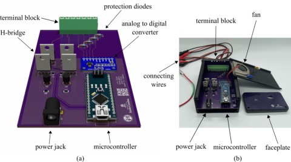
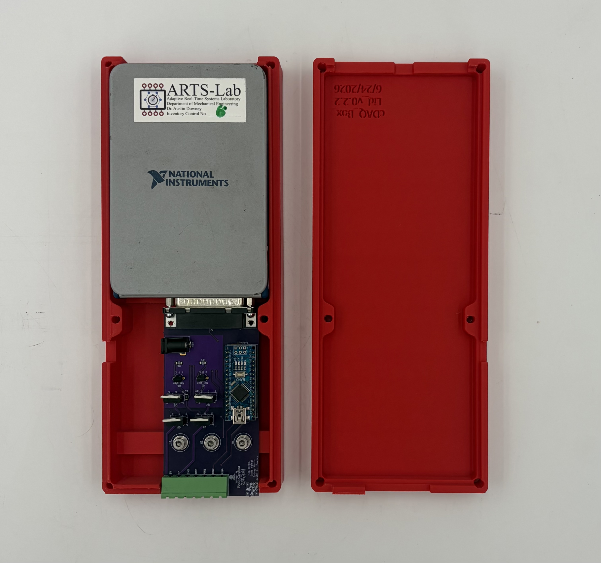

# DAQ Design
Hardware design and code for the DAQ system. Hardware variations are named after cities in central Italy. 

## Perugia
* Biphasic DAQ with ADC done on an embedded microcontroller

## Assisi
* Biphasic DAQ with ADC done using cDAQ hardware

